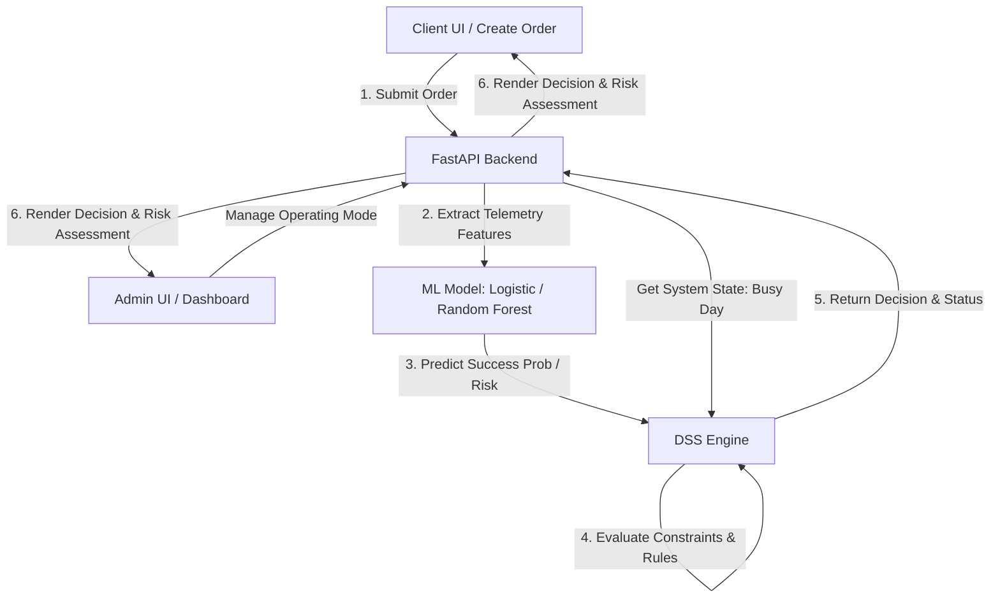

# System Flow - Drone Delivery DSS + ML System

This document outlines the workflow and architecture of the Drone Delivery DSS + ML System.

## Architectural Overview

The system consists of two primary operational layers:
1. **Machine Learning Layer (ML)**: Predicts flight success probability based purely on flight telemetry variables.
2. **Decision Support System Layer (DSS)**: Applies operational constraints and business rules to dynamically approve or reject drone dispatches.

## Step-by-Step Flow

### 1. Delivery Request Submission
- The **Client** submits a delivery order specifying:
  - Client Name
  - Destination
  - Distance (km)
  - Payload weight (kg)
  - Payload type
- The backend automatically simulates telemetry conditions (or retrieves live weather telemetry in a production setting) such as wind speed, drone battery, and GPS accuracy.

### 2. Machine Learning Telemetry Assessment
- The telemetry data is fed into the selected ML model (Logistic Regression or Random Forest).
- The ML model outputs:
  - **Success Probability** (\(P_{success} \in [0.0, 1.0]\))
  - **Risk Score** (\(Risk = 1.0 - P_{success}\))
  - **Flight Prediction** (\(1 = Completed\), \(0 = Failed\))

### 3. Decision Support System Verification
- The DSS Engine receives the ML prediction output and checks it against operational rules:
  - **Wind Speed Check**: Cannot exceed 12 m/s.
  - **Battery Check**: Minimum 20% remaining.
  - **Payload Capacity Check**: Maximum 5 kg carry limit.
  - **Peak Hour (Busy Day) Adjustment**: If active, the system enforces stricter thresholds:
    - Minimum battery: 30%
    - Minimum ML success probability: 75%
  - **ML Probability Check**: Normal minimum success probability is 60%.

### 4. Final Dispatch Status
- If all checks pass, the order is updated to **APPROVED** and is dispatched.
- If any check fails, the order is marked as **REJECTED** with a specific reason detailing which constraint was violated.
- Results are pushed back to the client UI and recorded on the admin dashboard.
